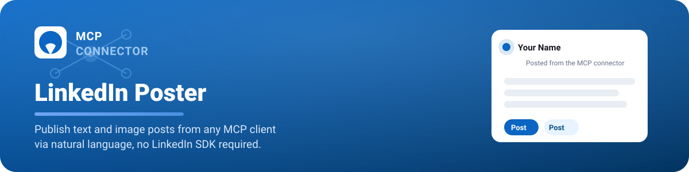

<div align="center">



**LinkedIn Poster MCP — Publish to LinkedIn via natural language.**

**Post to LinkedIn without leaving the chat.**

</div>

<p align="center">
  
  
  
  
  
  
</p>

---

A **Model Context Protocol** server that turns any MCP client into a LinkedIn publisher — text posts, image posts with alt text, profile lookups, and token-health checks, all driven by natural language instead of the LinkedIn API console.

```text
› Post the launch photo to LinkedIn, caption it about our v2 release.
// MCP tool call resolved automatically
{
  "tool": "create_image_post",
  "caption": "Shipping v2 today",
  "images": ["launch.png"]
}
// polling upload status… AVAILABLE
ok post created — urn:li:share:7183…
```

## Highlights

| | | | |
|---|---|---|---|
| **Never a blank image** | **Two transports** | **Admin dashboard** | **Bearer-guarded endpoint** |
| Polls LinkedIn's Images API until status is `AVAILABLE` before the post is created. | Streamable HTTP on Vercel for production, plus a bundled stdio entry for local clients. | Optional panel surfacing auth status and tool call logs at a glance. | Every call to `/api/mcp` requires a bearer token before protocol handling begins. |

## MCP tools

Four tools, one bearer token. Every tool call authenticates through the same Redis-backed token — no per-call re-auth.

| Tool | Input | Returns |
|------|-------|---------|
| `create_post` | `text`, `visibility?` | created post ID |
| `create_image_post` | `caption`, `images[1..20]`, `visibility?` | created post ID |
| `get_profile` | — | name + email |
| `check_auth_status` | — | token validity + expiry |

## Architecture

**Stateless endpoint, stateful token.**

```text
api/
  authorize.ts     GET   start LinkedIn OAuth (CSRF state in Redis)
  callback.ts      GET   exchange code for tokens, store, success page
  mcp.ts           POST  MCP endpoint, bearer-auth, tools
  dashboard.ts     GET   admin dashboard API
frontend/                React + Tailwind + MUI dashboard source -> public/
lib/
  config.ts               env vars, URLs, Redis client
  linkedin-auth.ts        token exchange, refresh, access-token helper
  linkedin-api.ts         profile, create_post, create_image_post
  logging.ts              structured logs to Redis
  errors.ts               NotAuthorizedError, LinkedInError
mcp-stdio.mjs       esbuild-bundled stdio entry
```

Facts worth remembering:

- **Tokens** live under a single Redis key, `linkedin:tokens`.
- `/api/mcp` is stateless and requires `Authorization: Bearer <MCP_AUTH_TOKEN>` on every request.
- **All LinkedIn calls** use raw `fetch()` — no LinkedIn SDK dependency.

## OAuth flow

One authorization, sixty days of posting.

```text
Client -> /api/authorize -> LinkedIn OAuth -> /callback -> Redis -> MCP tools
```

| Step | What happens |
|------|--------------|
| **01** | `/api/authorize` creates a CSRF `state`, stores it in Redis for 10 minutes, redirects to LinkedIn. |
| **02** | LinkedIn authenticates the user and redirects back to `/api/callback?code=...&state=...`. |
| **03** | `/api/callback` validates `state`, exchanges the code, saves tokens to Redis. |
| **04** | Tools call `getValidAccessToken()` — refreshing near expiry, or throwing `NotAuthorizedError`. |

> **Note:** LinkedIn issues a `refresh_token` only for apps provisioned with programmatic refresh. On the standard scope set, access tokens last 60 days and the user re-authorizes on expiry — `check_auth_status` always reports the real state.

## Image upload

**Why posts never render blank.**

1. **Register** — the server registers the upload and receives a signed `uploadUrl`.
2. **Upload** — image bytes are uploaded directly to that signed URL.
3. **Poll -> post** — status is polled until `AVAILABLE`, then — and only then — the post is created.

## Setup

### Prerequisites

- Node.js **24+**
- LinkedIn Developer app with approved scopes: `openid profile email w_member_social`
- An Upstash Redis database

### Environment variables

Set these in Vercel and in a root `.env` for local development:

| Variable | Purpose |
|----------|---------|
| `LINKEDIN_CLIENT_ID` | LinkedIn app client ID |
| `LINKEDIN_CLIENT_SECRET` | LinkedIn app client secret |
| `LINKEDIN_REDIRECT_URI` | Must match a whitelisted redirect URL exactly |
| `UPSTASH_REDIS_REST_URL` | Upstash Redis REST URL |
| `UPSTASH_REDIS_REST_TOKEN` | Upstash Redis REST token |
| `MCP_AUTH_TOKEN` | Bearer token MCP clients send to `/api/mcp` |

These files are git-ignored — never commit secrets.

### Local development

```bash
npm install
vercel dev          # http://localhost:3000/api/...
npm run typecheck   # tsc --noEmit
```

### Redirect URIs

```text
local    http://localhost:3000/api/callback
prod     https://<your-app>.vercel.app/api/callback
```

Whitelist the exact URL in the LinkedIn Developer Portal — LinkedIn matches redirects with no tolerance for query params.

## Client setup

Remote or local — pick one.

<details>
<summary><b>Remote — Streamable HTTP</b></summary>

- **Type:** Custom / MCP server, Streamable HTTP
- **Endpoint:** `https://<your-deployed-url>/api/mcp`
- **Header:** `Authorization: Bearer <MCP_AUTH_TOKEN>`
</details>

<details>
<summary><b>Local — stdio</b></summary>

Point the client at the bundled entry:

```text
node /path/to/linkedin-post-mcp/mcp-stdio.mjs
```
</details>

## Deploy

Ship it to Vercel.

```bash
vercel           # preview
vercel --prod    # production
```

- `vercel.json` pins `api/**` to the Node.js runtime.
- Set the production callback URL for LinkedIn.
- After deploying, open `/api/authorize` once — then every tool works.

## Security

What's actually guarded.

- **Secrets** come from environment variables only — nothing is logged.
- **Endpoint** — the MCP endpoint requires a bearer token before protocol handling.
- **CSRF** — OAuth `state` guards against request forgery and is one-time-use with a short TTL.

---

<p align="center">
<sub>Node.js 24+ · Streamable HTTP + stdio · Upstash Redis · LinkedIn OAuth2</sub>
</p>